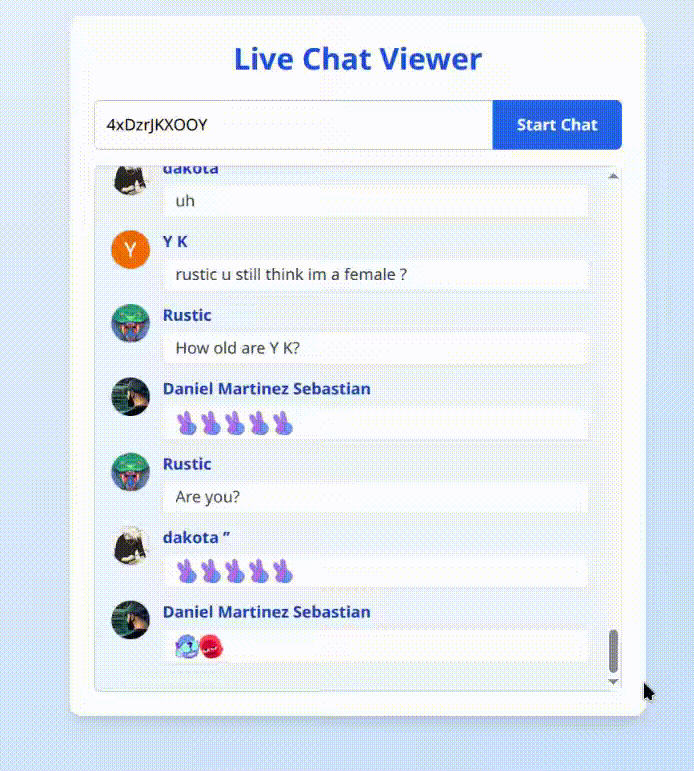

# multichat (YouTube Live Chat Viewer) 🎉

> Vista previa:
> 
> 
> **multichat** renderiza en tiempo real los mensajes y emojis personalizados del chat en vivo de YouTube.

Este proyecto permite visualizar en tiempo real el chat de un video en vivo de YouTube usando Next.js, Express, Socket.IO y la librería `youtube-chat`.

## Requisitos
- Node.js 18 o 20 (no usar Node 22)
- npm

## Instalación

1. Clona el repositorio o descarga el código.
2. Instala las dependencias del proyecto:
   ```sh
   npm install
   ```
3. Instala `ts-node` y los tipos necesarios (si no se instalaron automáticamente):
   ```sh
   npm install --save-dev ts-node typescript @types/node @types/express @types/react
   ```

## Uso

1. Inicia el servidor de desarrollo con ts-node:
   ```sh
   npm run dev
   ```
2. Abre tu navegador en [http://localhost:3000](http://localhost:3000) 🌐
3. Ingresa el **ID del video en vivo de YouTube** en el campo de texto y haz clic en "Start Chat". ▶️
4. Verás los mensajes del chat en tiempo real, incluyendo texto y emojis. 😃

## ¿Cómo obtener el ID de un video de YouTube?

El **ID del video** es la parte que aparece después de `v=` en la URL. Por ejemplo, para la URL:

```
https://www.youtube.com/watch?v=vYIYIVmOo3Q
```

El ID del video es:

```
vYIYIVmOo3Q
```

Solo copia esa parte y pégala en el campo de la app.

## Estructura del proyecto
- `pages/index.tsx`: Interfaz web para ingresar el videoId y ver el chat.
- `server/socketServer.ts`: Configuración de Socket.IO y conexión con el scraper.
- `lib/chatScraper.ts`: Scraper que obtiene los mensajes del chat de YouTube.
- `server.ts`: Inicialización de Next.js y Express usando ts-node.

## Notas
- Solo funciona con videos que estén **en vivo**. 🔴
- Si no ves mensajes nuevos, asegúrate de que el videoId es correcto y que el stream está activo.
- Si tienes problemas con los emojis, asegúrate de tener la última versión de la librería `youtube-chat`.
- El servidor se ejecuta directamente con `ts-node`, por lo que no es necesario compilar manualmente.

## Créditos
- [youtube-chat](https://www.npmjs.com/package/youtube-chat)
- [Next.js](https://nextjs.org/)
- [Socket.IO](https://socket.io/)
- [Express](https://expressjs.com/)

---
¡Disfruta monitoreando chats en vivo de YouTube! 🚀

## Contribuciones
Si deseas contribuir al proyecto, no dudes en abrir un **issue** o enviar un **pull request**. Todas las contribuciones son bienvenidas. 🙌

